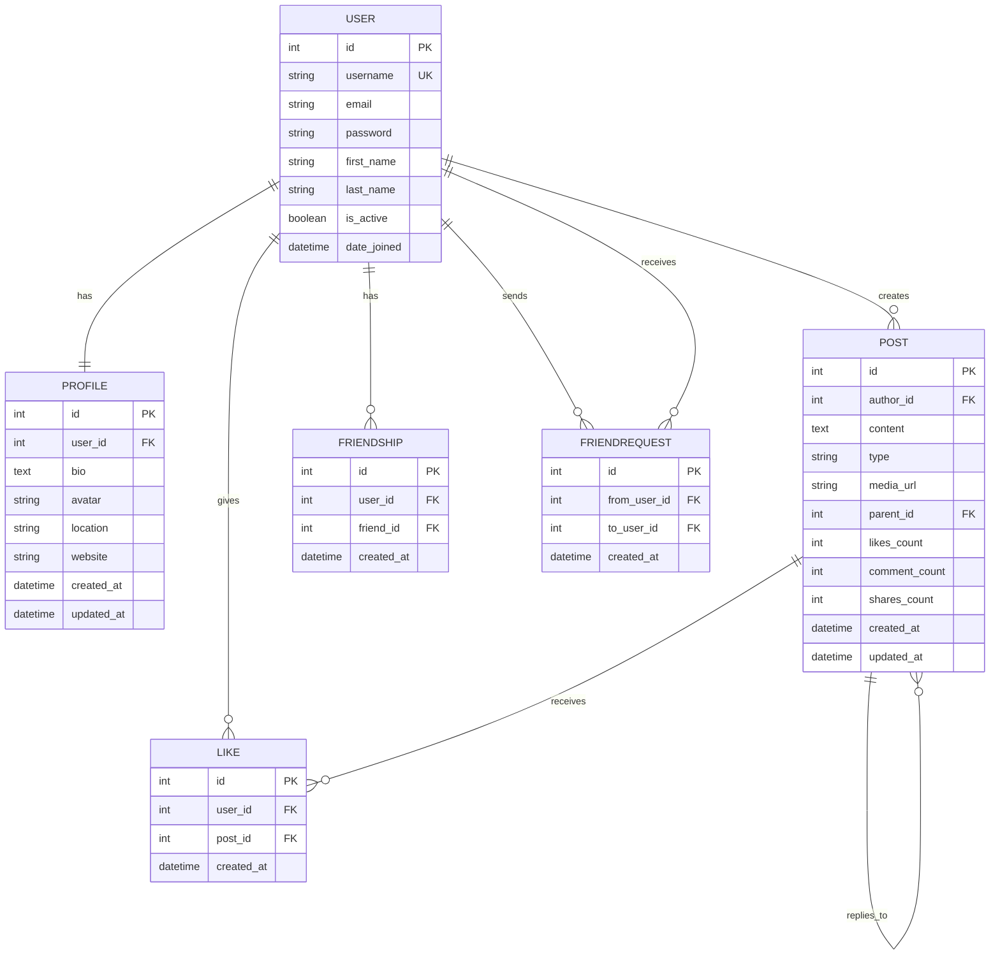

# ERD Generation Prompt

Use this prompt with an AI tool (Claude, ChatGPT, etc.) to generate a proper Entity Relationship Diagram for Numeneon.

---

## Copy This Prompt

```
Create a professional Entity Relationship Diagram (ERD) for a Django social media application with these models:

## Models

### 1. User (Django built-in auth.User)
- id: AutoField (PK)
- username: CharField(150), unique
- email: EmailField
- password: CharField (hashed)
- first_name: CharField(150)
- last_name: CharField(150)
- is_active: BooleanField
- date_joined: DateTimeField

### 2. Profile (extends User)
- id: AutoField (PK)
- user: OneToOneField → User (CASCADE)
- bio: TextField(500), nullable
- avatar: URLField(500), nullable
- location: CharField(100), nullable
- website: URLField(200), nullable
- created_at: DateTimeField
- updated_at: DateTimeField

### 3. Post
- id: AutoField (PK)
- author: ForeignKey → User (CASCADE)
- content: TextField(500), required
- type: CharField(20), choices=['thoughts', 'media', 'milestones'], default='thoughts'
- media_url: URLField(500), nullable
- parent: ForeignKey → self (CASCADE), nullable (for replies/threading)
- likes_count: IntegerField, default=0
- comment_count: IntegerField, default=0
- shares_count: IntegerField, default=0
- created_at: DateTimeField
- updated_at: DateTimeField

### 4. Like
- id: AutoField (PK)
- user: ForeignKey → User (CASCADE)
- post: ForeignKey → Post (CASCADE)
- created_at: DateTimeField
- CONSTRAINT: unique_together(user, post)

### 5. Friendship
- id: AutoField (PK)
- user: ForeignKey → User (CASCADE)
- friend: ForeignKey → User (CASCADE)
- created_at: DateTimeField
- CONSTRAINT: unique_together(user, friend)

### 6. FriendRequest
- id: AutoField (PK)
- from_user: ForeignKey → User (CASCADE)
- to_user: ForeignKey → User (CASCADE)
- created_at: DateTimeField
- CONSTRAINT: unique_together(from_user, to_user)

## Relationships Summary
- User 1:1 Profile
- User 1:* Post (as author)
- User 1:* Like
- Post 1:* Like
- Post 1:* Post (self-reference for replies)
- User *:* User (via Friendship as junction)
- User *:* User (via FriendRequest as junction, directional)

## Requirements
1. Use crow's foot notation for cardinality
2. Show primary keys (PK) and foreign keys (FK)
3. Include all fields with data types
4. Show unique constraints
5. Use professional styling (clean, readable)
6. Group by Django app: users (Profile), posts (Post, Like), friends (Friendship, FriendRequest)
7. Color code: User=blue, Profile=light blue, Posts=green, Friends=purple

Output as:
- Mermaid diagram code (for GitHub/docs)
- OR description I can recreate in Lucidchart/draw.io
```

---

## Expected Output (Mermaid)

When you run the prompt, you should get something like:



---

## Tools to Visualize

1. **Mermaid Live Editor**: https://mermaid.live

   - Paste the Mermaid code, get instant diagram

2. **dbdiagram.io**: https://dbdiagram.io

   - More professional styling
   - Export to PNG/PDF

3. **Lucidchart**: https://lucidchart.com

   - Drag-and-drop ERD builder

4. **draw.io**: https://draw.io
   - Free, offline capable
